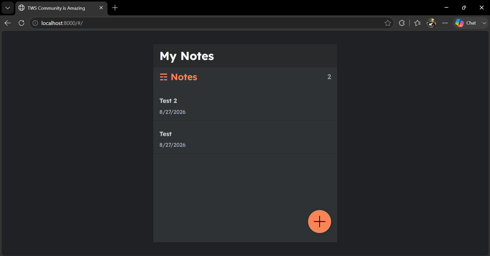
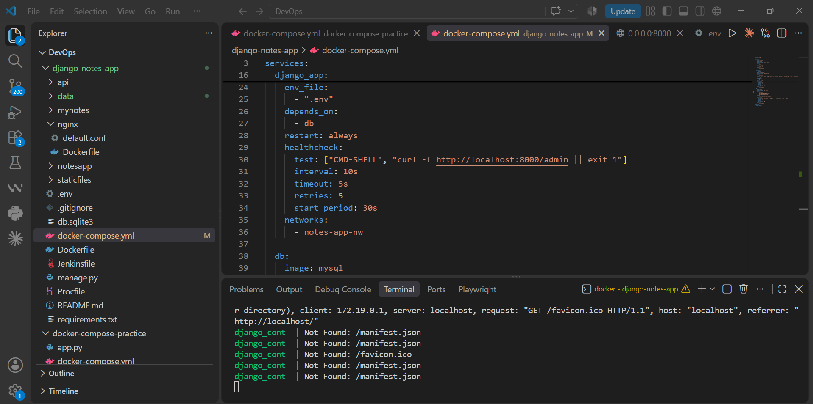
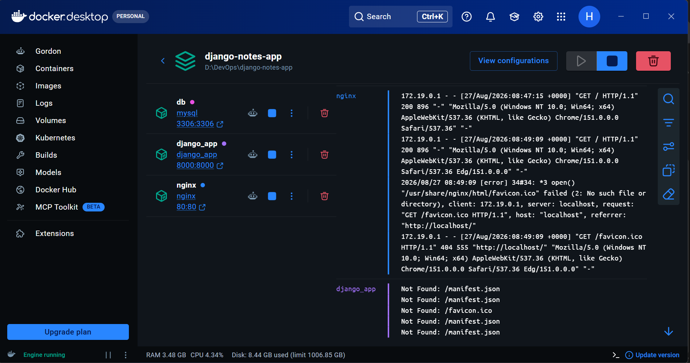

# 🐳 Docker DevOps Project – Django Notes Application

A complete Dockerized **Django Notes Application** demonstrating containerization, multi-container orchestration, networking, persistent storage, healthchecks, environment configuration, and Nginx reverse proxy.

---

## 📌 Table of Contents

- [Project Overview](#-project-overview)
- [Architecture](#-architecture)
- [Technology Stack](#-technology-stack)
- [Project Structure](#-project-structure)
- [How the Application Works](#-how-the-application-works)
- [Docker Components](#-docker-components)
- [Environment Variables](#-environment-variables)
- [Docker Compose](#-docker-compose)
- [Database](#-database)
- [Nginx Reverse Proxy](#-nginx-reverse-proxy)
- [Docker Networking](#-docker-networking)
- [Docker Volumes](#-docker-volumes)
- [Healthchecks](#-healthchecks)
- [Setup & Installation](#-setup--installation)
- [Run the Project](#-run-the-project)
- [Verify the Application](#-verify-the-application)
- [Useful Docker Commands](#-useful-docker-commands)
- [Database Commands](#-database-commands)
- [Logs & Troubleshooting](#-logs--troubleshooting)
- [Common Problems](#-common-problems)
- [Security Best Practices](#-security-best-practices)
- [DevOps Concepts Demonstrated](#-devops-concepts-demonstrated)
- [Learning Outcomes](#-learning-outcomes)
- [Future Improvements](#-future-improvements)
- [Author](#-author)

---

## 🚀 Project Overview

This project demonstrates how a traditional web application can be converted into a **multi-container Docker application**.

The application uses:

- **Django** for backend/application logic
- **MySQL** for persistent application data
- **Nginx** as a reverse proxy
- **Docker** for containerization
- **Docker Compose** for orchestration
- **`.env`** for configuration and database credentials
- **Docker volumes** for database persistence
- **Docker healthchecks** to verify service readiness

The project follows a simple three-tier architecture:

```text
                    USER / BROWSER
                           |
                           | HTTP :80
                           v
                    +--------------+
                    |    NGINX     |
                    | Reverse Proxy|
                    +--------------+
                           |
                           | HTTP :8000
                           v
                    +--------------+
                    |    DJANGO    |
                    |   Backend    |
                    +--------------+
                           |
                           | MySQL :3306
                           v
                    +--------------+
                    |    MYSQL     |
                    |   Database   |
                    +--------------+
                           |
                           v
                       DB VOLUME
```

---

## 🏗️ Architecture

The application is divided into three main services:

### 1. Django

Django is the main application/backend service.

Responsibilities:

- Runs the Python/Django application
- Handles application requests
- Connects to MySQL
- Runs database migrations
- Serves the application through Gunicorn

Typical internal port:

```text
8000
```

---

### 2. MySQL

MySQL stores the application's persistent data.

Responsibilities:

- Store application records
- Provide database services to Django
- Persist data through Docker volumes

Typical internal port:

```text
3306
```

Example configuration:

```env
DB_NAME=test_db
DB_USER=root
DB_PASSWORD=root
DB_HOST=db_cont
DB_PORT=3306
```

> `db_cont` is the Docker container hostname used by Django to reach MySQL. It is not a MySQL account name.

---

### 3. Nginx

Nginx acts as the reverse proxy and public entry point.

Responsibilities:

- Accept browser requests
- Listen on port `80`
- Forward requests to Django
- Provide a single public endpoint for the application

Typical flow:

```text
Browser
   ↓
localhost:80
   ↓
Nginx
   ↓
Django:8000
   ↓
MySQL:3306
```

---

## 🧰 Technology Stack

| Technology | Purpose |
|---|---|
| Docker | Containerization |
| Docker Compose | Multi-container orchestration |
| Django | Backend/application framework |
| Python | Backend programming language |
| MySQL | Database |
| Nginx | Reverse proxy/web server |
| Gunicorn | Django application server |
| Docker Network | Container-to-container communication |
| Docker Volume | Persistent database storage |
| `.env` | Environment configuration |
| Docker Scout | Image vulnerability scanning |

---

## 📁 Project Structure

A typical project structure is:

```text
docker-devops-project/
│
├── app/
│   ├── backend/
│   │   ├── manage.py
│   │   ├── requirements.txt
│   │   ├── <django-project>/
│   │   └── <django-app>/
│   │
│   └── frontend/
│       ├── public/
│       └── src/
│
├── nginx/
│   └── nginx.conf
│
├── Dockerfile
├── docker-compose.yml
├── .env
├── .dockerignore
└── README.md
```

> The exact folder names can vary depending on the repository implementation. Keep this structure aligned with your actual project files.

---

# 🔄 How the Application Works

When a user opens:

```text
http://localhost
```

the request follows this path:

```text
1. Browser
      ↓
2. Nginx :80
      ↓
3. Django/Gunicorn :8000
      ↓
4. Django processes request
      ↓
5. Django communicates with MySQL :3306
      ↓
6. MySQL returns data
      ↓
7. Django returns response
      ↓
8. Nginx sends response to browser
```

This separation makes the application easier to deploy, maintain, scale, and troubleshoot.

---

# 🐳 Docker Components

## Dockerfile

The `Dockerfile` defines how the application image is built.

Typical responsibilities:

- Select a base image
- Set the working directory
- Install dependencies
- Copy application source code
- Configure the application
- Define the startup command

Example conceptual flow:

```text
Base Python Image
       ↓
Install Dependencies
       ↓
Copy Application
       ↓
Configure Environment
       ↓
Run Django/Gunicorn
```

---

# 🔐 Environment Variables

The `.env` file stores configuration values outside the application source code.

Example:

```env
DB_NAME=test_db
DB_USER=root
DB_PASSWORD=root
DB_PORT=3306
DB_HOST=db_cont
```

### Meaning

| Variable | Meaning |
|---|---|
| `DB_NAME` | MySQL database name |
| `DB_USER` | Database username |
| `DB_PASSWORD` | Database password |
| `DB_PORT` | MySQL port |
| `DB_HOST` | Docker hostname of MySQL |

### Important

For real production deployments, do **not** commit passwords or secrets to GitHub.

Use:

```text
.env
```

and add it to `.gitignore`:

```gitignore
.env
```

---

# ⚙️ Docker Compose

`docker-compose.yml` is the central blueprint of the application.

It defines:

- Services
- Images/builds
- Ports
- Environment variables
- Networks
- Volumes
- Dependencies
- Healthchecks
- Restart behavior

Example architecture:

```yaml
services:

  db:
    image: mysql
    container_name: db_cont

  django:
    build: .
    container_name: django_cont

  nginx:
    image: nginx
    container_name: nginx_cont
```

---

# 🗄️ Database

The project uses MySQL.

The database is created/configured through the MySQL container environment.

Example:

```env
MYSQL_DATABASE=test_db
MYSQL_ROOT_PASSWORD=root
```

Django connects using:

```env
DB_NAME=test_db
DB_USER=root
DB_PASSWORD=root
DB_HOST=db_cont
DB_PORT=3306
```

### Do I need MySQL installed on Windows?

**No.**

If MySQL is running inside Docker, you do not need to separately install MySQL on your Windows machine.

You also do not normally need to manually create Django tables.

Django migrations handle application tables:

```bash
python manage.py migrate
```

---

# 🔗 Docker Networking

Docker Compose creates an internal network for the services.

Containers can communicate using service/container names rather than manually configured IP addresses.

For example:

```env
DB_HOST=db_cont
```

Django can reach MySQL through:

```text
db_cont:3306
```

Conceptually:

```text
django_cont
     |
     | Docker Network
     |
     +------> db_cont:3306
```

This is more reliable than hardcoding a container IP address.

---

# 💾 Docker Volumes

Database containers should use persistent storage.

Without a volume:

```text
Container deleted
      ↓
Database data may be lost
```

With a volume:

```text
Container deleted
      ↓
Volume remains
      ↓
Database data remains
```

Example:

```yaml
volumes:
  mysql_data:
```

and:

```yaml
services:
  db:
    volumes:
      - mysql_data:/var/lib/mysql
```

This is especially important for databases.

---

# ❤️ Healthchecks

One of the important problems in this project is **database startup timing**.

MySQL may take several seconds to initialize.

If Django starts immediately:

```text
Django starts
      ↓
Connect to MySQL
      ↓
MySQL not ready
      ↓
Connection error
      ↓
Django exits/restarts
```

A healthcheck improves this:

```text
MySQL starts
      ↓
Healthcheck
      ↓
MySQL ready
      ↓
Database becomes healthy
      ↓
Django starts
      ↓
Django connects successfully
```

Example:

```yaml
healthcheck:
  test: ["CMD", "mysqladmin", "ping", "-h", "localhost"]
  interval: 5s
  timeout: 5s
  retries: 10
```

Then Compose can use dependency conditions so Django waits for a healthy database.

---

# 🌐 Nginx Reverse Proxy

Nginx provides the public entry point.

Instead of exposing Django directly to users:

```text
User → Django
```

the architecture uses:

```text
User
  ↓
Nginx
  ↓
Django
```

### Why use Nginx?

- Reverse proxy
- Centralized traffic handling
- Static file serving
- SSL/TLS termination capability
- Access control
- Caching capability
- Better production architecture
- Easier future scaling

---

# 🚀 Setup & Installation

## Prerequisites

Install:

1. Docker Desktop
2. Git
3. A code editor such as VS Code

Verify Docker:

```bash
docker --version
```

Verify Compose:

```bash
docker compose version
```

Verify Git:

```bash
git --version
```

---

# 📥 Clone the Repository

```bash
git clone https://github.com/hritikranjan1/django-notes-app.git
```

Move into the project:

```bash
cd django-notes-app
```

---

# 🔐 Configure `.env`

Create:

```text
.env
```

Example:

```env
DB_NAME=test_db
DB_USER=root
DB_PASSWORD=root
DB_PORT=3306
DB_HOST=db_cont
```

Your Compose MySQL configuration must use compatible database credentials.

For example:

```env
MYSQL_DATABASE=test_db
MYSQL_ROOT_PASSWORD=root
```

> Do not expose real production credentials in README files or public repositories.

---

# 🏗️ Build and Start

Recommended modern Docker Compose command:

```bash
docker compose up -d --build
```

This will:

1. Build the application image
2. Pull required images
3. Create networks
4. Create volumes
5. Create containers
6. Start MySQL
7. Wait for required health conditions
8. Start Django
9. Start Nginx

---

# 🔍 Check Running Containers

Run:

```bash
docker ps
```

Expected architecture:

```text
db_cont
django_cont
nginx_cont
```

Example:

```text
CONTAINER ID   IMAGE        STATUS
xxxxxx         mysql        Up (healthy)
xxxxxx         django_app   Up (healthy)
xxxxxx         nginx        Up
```

---

# 🌍 Access the Application

### Through Nginx

Open:

```text
http://localhost
```

This is the preferred application entry point.

### Direct Django access

If port 8000 is exposed:

```text
http://localhost:8000
```

This bypasses Nginx and is useful for troubleshooting.

---

# ✅ Verify the Application

## Test Django

PowerShell:

```powershell
curl.exe http://localhost:8000
```

A successful response should contain:

```text
HTTP/1.1 200 OK
```

or an equivalent successful HTTP response.

---

## Test Nginx

```powershell
curl.exe http://localhost
```

Then open:

```text
http://localhost
```

in a browser.

---

# 🗄️ Connect to MySQL

If the MySQL container is named:

```text
db_cont
```

run:

```bash
docker exec -it db_cont mysql -uroot -proot
```

Then:

```sql
SHOW DATABASES;
```

Select the database:

```sql
USE test_db;
```

Check tables:

```sql
SHOW TABLES;
```

Exit:

```sql
exit;
```

---

# 🧪 Run Django Migrations

Enter the Django container:

```bash
docker exec -it django_cont sh
```

Then:

```bash
python manage.py migrate
```

Check migrations:

```bash
python manage.py showmigrations
```

Exit:

```bash
exit
```

---

# 📜 Logs & Troubleshooting

## View all logs

```bash
docker compose logs
```

Follow logs:

```bash
docker compose logs -f
```

---

## Django logs

```bash
docker logs django_cont
```

Follow:

```bash
docker logs -f django_cont
```

---

## MySQL logs

```bash
docker logs db_cont
```

---

## Nginx logs

```bash
docker logs nginx_cont
```

---

# 🔎 Check Container Status

```bash
docker compose ps
```

or:

```bash
docker ps
```

Healthy example:

```text
db_cont       Up (healthy)
django_cont   Up (healthy)
nginx_cont    Up
```

---

# 🛑 Stop the Project

```bash
docker compose down
```

This stops and removes containers and the Compose network.

Named volumes are normally preserved unless explicitly removed.

---

# ▶️ Start Again

After stopping:

```bash
docker compose up -d
```

If code or Docker configuration changed:

```bash
docker compose up -d --build
```

---

# 🧹 Remove Containers

```bash
docker compose down
```

To also remove volumes:

```bash
docker compose down -v
```

⚠️ **Warning:** Removing the database volume can delete persistent database data.

Use `down -v` carefully.

---

# 🔄 Rebuild From Scratch

If you need to rebuild images:

```bash
docker compose down
docker compose build --no-cache
docker compose up -d
```

Do not use `down -v` unless you intentionally want to remove database volumes.

---

# 🧰 Useful Docker Commands

### List containers

```bash
docker ps
```

All containers:

```bash
docker ps -a
```

### List images

```bash
docker images
```

### List volumes

```bash
docker volume ls
```

### List networks

```bash
docker network ls
```

### Inspect container

```bash
docker inspect django_cont
```

### Container shell

```bash
docker exec -it django_cont sh
```

### Restart service

```bash
docker compose restart django
```

### Stop one service

```bash
docker compose stop django
```

### Start one service

```bash
docker compose start django
```

---

# 🐞 Common Problems

## 1. Django cannot connect to MySQL

Error:

```text
django.db.utils.OperationalError:
Can't connect to server on 'db_cont'
```

Possible reason:

MySQL is still initializing.

Check:

```bash
docker compose ps
```

Then:

```bash
docker logs db_cont
```

Look for:

```text
ready for connections
```

Healthchecks and `depends_on` should be configured so Django waits for database readiness.

---

## 2. Django container keeps restarting

Check:

```bash
docker logs django_cont
```

Common causes:

- Database unavailable
- Incorrect `.env`
- Missing Python package
- Migration failure
- Incorrect Django settings
- Incorrect startup command

---

## 3. Nginx is running but application does not open

Check:

```bash
docker logs nginx_cont
```

Then:

```bash
docker logs django_cont
```

Test Django directly:

```bash
curl.exe http://localhost:8000
```

If port `8000` works but port `80` does not, investigate the Nginx configuration.

---

## 4. Port already in use

If Docker reports:

```text
port is already allocated
```

find the process using the port.

On Windows:

```powershell
netstat -ano | findstr :80
```

For port 8000:

```powershell
netstat -ano | findstr :8000
```

---

## 5. Database exists but tables are missing

Run:

```bash
docker exec -it django_cont python manage.py migrate
```

Then:

```bash
docker exec -it db_cont mysql -uroot -proot
```

and:

```sql
USE test_db;
SHOW TABLES;
```

---

## 6. `.env` changes are not reflected

After changing environment configuration, recreate/restart the services:

```bash
docker compose down
docker compose up -d --build
```

If required, force recreation:

```bash
docker compose up -d --force-recreate
```

---

# 🔐 Security Best Practices

For learning, values such as:

```env
DB_USER=root
DB_PASSWORD=root
```

are acceptable.

For production:

- Do not use the MySQL `root` account for the application.
- Use a dedicated database user.
- Use a strong password.
- Do not commit `.env` to Git.
- Use secrets management.
- Scan images for vulnerabilities.
- Keep base images updated.
- Use least-privilege permissions.
- Expose only required ports.
- Configure HTTPS.
- Restrict database access to the internal Docker network.

---

# 🛡️ Docker Scout

Docker Scout can be used to identify vulnerabilities in container images.

Example:

```bash
docker scout quickview
```

You can also inspect an image:

```bash
docker scout cves <image-name>
```

The goal is to identify vulnerable packages and update the relevant base images/dependencies.

---

# 🏭 Multi-Stage Docker Builds

For applications that require a build stage, multi-stage Dockerfiles separate build dependencies from the final runtime image.

Concept:

```text
BUILD STAGE
-----------
Install build tools
Install dependencies
Build application
       |
       v
RUNTIME STAGE
-------------
Copy only required output
Run application
```

Benefits:

- Smaller images
- Fewer unnecessary packages
- Reduced attack surface
- Faster deployments

---

# 📦 `.dockerignore`

`.dockerignore` prevents unnecessary files from being sent to Docker during image builds.

Typical entries:

```text
.git
.gitignore
.env
__pycache__
*.pyc
venv
node_modules
README.md
```

This can improve build performance and prevent sensitive/unnecessary files from entering the build context.

---

# 🎯 DevOps Concepts Demonstrated

This project is useful as a DevOps learning project because it demonstrates:

### Containerization

```text
Application → Docker Image → Container
```

### Orchestration

```text
Docker Compose
      ↓
Django + MySQL + Nginx
```

### Networking

```text
django_cont → db_cont:3306
```

### Reverse Proxy

```text
Client → Nginx → Django
```

### Persistent Storage

```text
MySQL Container → Docker Volume
```

### Service Health

```text
MySQL → Healthcheck → Django
```

### Environment Configuration

```text
.env → Docker Compose → Container
```

### Image Security

```text
Docker Image → Docker Scout → Vulnerability Analysis
```

---

# 🧠 What I Learned From This Project

After completing this project, you should be able to explain:

- What Docker is
- Why containers are useful
- Difference between image and container
- What Docker Compose does
- How multiple containers communicate
- How Docker networking works
- Why service names can be used as hostnames
- Why databases require persistent volumes
- Why healthchecks are important
- What `depends_on` does
- Why Nginx is used as a reverse proxy
- How Django connects to MySQL
- How environment variables are passed to containers
- How to inspect container logs
- How to troubleshoot startup failures
- How to expose container ports
- How to rebuild and restart services
- How to perform Django migrations inside a container
- How container image vulnerabilities can be scanned

---

# 💼 Interview Explanation

If an interviewer asks:

### "Explain your Docker project."

You can answer:

> "I created a multi-container Django Notes Application using Docker and Docker Compose. The application uses Django as the backend, MySQL for persistent data storage, and Nginx as a reverse proxy. Docker Compose manages the complete application stack, including networking, volumes, environment variables, service dependencies, and healthchecks. Django connects to MySQL through the Docker network using the database container name as the hostname. I also implemented database persistence using Docker volumes and used healthchecks to prevent Django from starting before MySQL was ready. Nginx exposes the application through port 80 and forwards requests to the Django service."

---

# 🧩 Project Flow Summary

```text
                 ┌──────────────────────┐
                 │       Browser        │
                 └──────────┬───────────┘
                            │
                         HTTP :80
                            │
                            ▼
                 ┌──────────────────────┐
                 │        Nginx         │
                 │   Reverse Proxy      │
                 └──────────┬───────────┘
                            │
                         :8000
                            │
                            ▼
                 ┌──────────────────────┐
                 │       Django         │
                 │       Gunicorn       │
                 └──────────┬───────────┘
                            │
                         :3306
                            │
                            ▼
                 ┌──────────────────────┐
                 │        MySQL         │
                 │      test_db         │
                 └──────────┬───────────┘
                            │
                            ▼
                 ┌──────────────────────┐
                 │    Docker Volume     │
                 │ Persistent DB Data   │
                 └──────────────────────┘
```

---

# 📋 Quick Command Cheat Sheet

```bash
# Build and start
docker compose up -d --build

# Check containers
docker compose ps

# View logs
docker compose logs -f

# Django logs
docker logs -f django_cont

# MySQL logs
docker logs -f db_cont

# Nginx logs
docker logs -f nginx_cont

# Enter Django container
docker exec -it django_cont sh

# Run migrations
docker exec -it django_cont python manage.py migrate

# Connect to MySQL
docker exec -it db_cont mysql -uroot -proot

# Stop
docker compose down

# Rebuild
docker compose up -d --build

# Remove volumes - USE CAREFULLY
docker compose down -v
```

---

# 🌐 Application URLs

When running locally:

```text
Application through Nginx:
http://localhost

Django direct:
http://localhost:8000

MySQL:
localhost:3306
```

The recommended browser URL is:

```text
http://localhost
```

because it represents the intended reverse-proxy architecture.

---

# 📌 Project Checklist

Before considering the deployment successful, verify:

```text
[ ] Docker installed
[ ] Docker Compose available
[ ] Repository cloned
[ ] .env configured
[ ] Dockerfile available
[ ] docker-compose.yml available
[ ] Nginx configuration available
[ ] Images built successfully
[ ] MySQL container running
[ ] MySQL container healthy
[ ] Django container running
[ ] Django container healthy
[ ] Nginx container running
[ ] Database migrations completed
[ ] Database volume configured
[ ] http://localhost works
[ ] Django logs show no critical errors
```

---

# 🔧 Troubleshooting Flow

When the application does not work, troubleshoot in this order:

```text
1. Check Docker
       ↓
docker --version

2. Check containers
       ↓
docker compose ps

3. Check MySQL
       ↓
docker logs db_cont

4. Check Django
       ↓
docker logs django_cont

5. Check Nginx
       ↓
docker logs nginx_cont

6. Test Django directly
       ↓
curl.exe http://localhost:8000

7. Test Nginx
       ↓
curl.exe http://localhost

8. Check database
       ↓
docker exec -it db_cont mysql -uroot -proot
```

This approach helps identify whether the problem is with the database, backend, reverse proxy, networking, or application configuration.

---

# 📈 Future Improvements

Possible next steps for this project:

- Add HTTPS with SSL/TLS
- Use a non-root MySQL application user
- Add Redis
- Add Celery for background jobs
- Add CI/CD with GitHub Actions or Jenkins
- Push Docker images to Docker Hub/Amazon ECR
- Deploy to AWS EC2/ECS
- Add Prometheus and Grafana monitoring
- Add centralized logging
- Add automated tests
- Add image vulnerability scanning to CI/CD
- Use Docker secrets or a cloud secrets manager
- Add Kubernetes deployment manifests
- Add production-ready Gunicorn/Nginx configuration

---

# 📚 Learning Resources

This project follows concepts covered in a Docker-focused DevOps learning path, including:

- Docker fundamentals
- Docker commands
- Dockerfiles
- Docker networking
- Docker volumes
- Docker Compose
- Healthchecks
- Multi-stage builds
- Nginx reverse proxy
- Application containerization
- Database containers
- Docker image security
- Docker Scout

The source material referenced for this project is the **Docker In One Shot** learning guide by TrainWithShubham.

---

# ⭐ Why This Is a Good DevOps Project

This project goes beyond simply running:

```bash
docker run
```

It demonstrates a realistic application architecture:

```text
Application
    +
Database
    +
Reverse Proxy
    +
Container Networking
    +
Persistent Storage
    +
Healthchecks
    +
Environment Configuration
    +
Security Scanning
```

That makes it a useful portfolio project for demonstrating practical Docker and DevOps fundamentals.

---
## 🎥 Reference Video

This project is based on the following tutorial by **Train with Shubham**:

▶️ **Dockerizing a Django Application**  
https://youtu.be/9bSbNNH4Nqw

**Creator:** Train with Shubham
```
## 📸 Project Screenshots

### 1. Application Output

This screenshot shows the final output of the Django Notes application.




### 2. VS Code – Project Code

This screenshot shows the project source code and structure in VS Code.




### 3. Docker Image Build Process

This screenshot shows the Docker image being built successfully.


---

## ⭐ If this project helped you

Give the repository a ⭐ and use it as a starting point for learning Docker, Docker Compose, and DevOps deployment practices.


